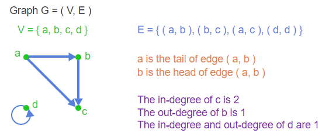
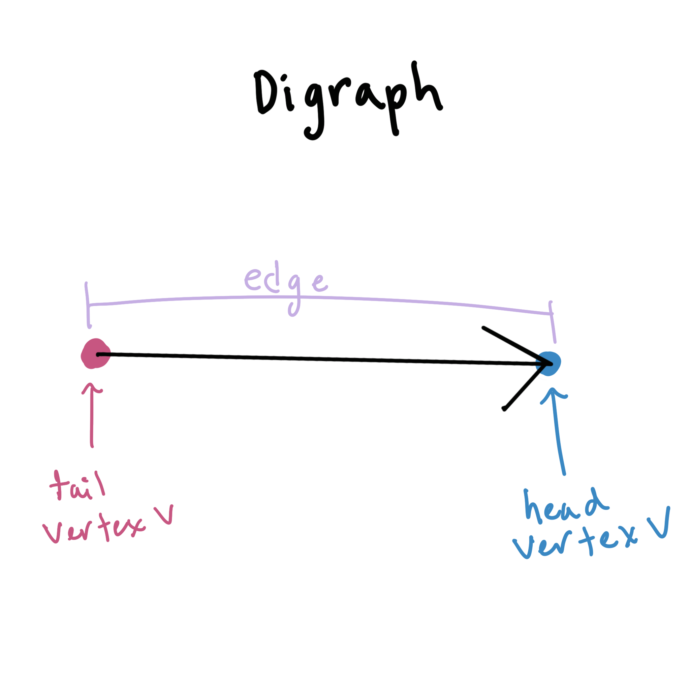

# Directed Graphs, Paths, and Cycles

## digraph (directed graph)

A digraph has the path $(V, E)$. 

- V is a set of vertices and 
- E is a set of directed edges that are a subset of $VxV$

## in-degree and out-degree

__In-degree:__
 The in-degree of a vertex is the number of edges pointing into it.

__Out-degree:__
The out-degree of a vertex is the number of edges pointing out of it.

in-degree(u) $= |{ v | (v, u) ∈ E }|$
out-degree(u) $= |{ v | (u, v) ∈ E }|$

## Walk

A sequence of alternating vertices and edges that starts and ends with a vertex.

A walk from $v_0$ to $v_i$
$\langle v_0, (v_0, v_1), v_1, ... ,(v_{i-1}, v_i), v_i\rangle$

Or a sequence of vertices.
$\langle v_0, v_1, ... ,v_i\rangle$

__length of walk:__ (i) The number of edges in a walk.

### open vs. closed walk

__open walk:__
When first and last vertices are not the same.

__closed walk:__
When first and last vertices are the same.

## trail
An open walk where no edge occurs more than once.

## circuit 
A closed walk where no edge occurs more than once.

## path
A trail where no vertex occurs more than once.

## cycle  
A circuit length (at least 1). The first and last vertices are the same, and no other vertex occurs more than once. 